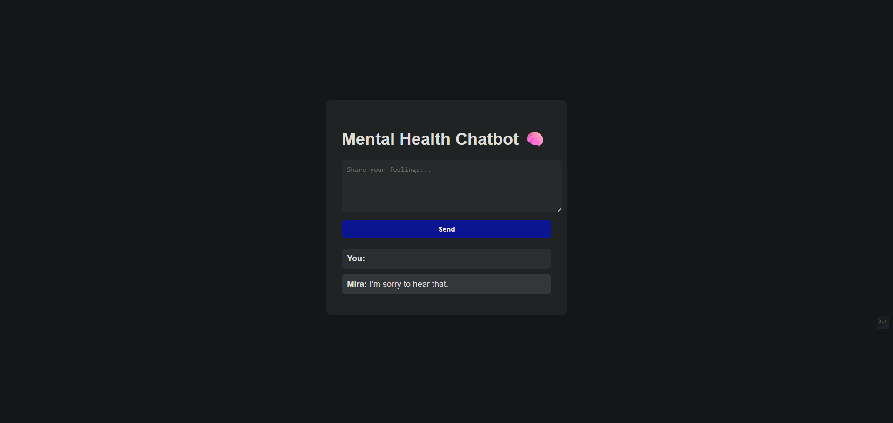

# 🧠 AI Chatbot for Mental Health Support

A simple and empathetic chatbot built to offer mental health support through friendly, human-like conversations. It uses a pre-trained language model and provides a clean web interface using Flask. This project was built as part of an internship to explore the real-world application of AI in sensitive domains like emotional well-being.

---

## 💡 Overview

This chatbot listens, understands, and responds empathetically to user inputs. The model is based on Microsoft's `GODEL-v1_1-large-seq2seq` transformer and has been integrated into a Flask web app with a clean front-end.

---

## 🧰 Tech Stack

- **Python 3.10+**
- **Transformers** (from Hugging Face)
- **Flask** (for web app and routing)
- **HTML + CSS** (for the frontend UI)
- **Torch** (for running the model)
- **Gunicorn** (for production-ready deployment)

---

## 🚀 How It Works

1. User inputs a message through a form on the webpage.
2. The input is passed to a `get_bot_response()` function that uses a transformer model to generate an empathetic reply.
3. Both user input and bot reply are logged with timestamps in a `.log` file.
4. The response is rendered back to the user.

---

## 🗂️ Project Structure

mental-health-chatbot/
├── app/
│ ├── chatbot.py # Bot logic using GODEL transformer
│ ├── logger.py # Logs each user-bot exchange
│ ├── routes.py # Flask routes and core web logic
│ ├── static/
│ │ └── style.css # Page styling
│ └── templates/
│ └── index.html # Main frontend page
├── run.py # App entry point
├── requirements.txt # All dependencies
├── .gitignore # Ignore venv, logs, pycache
└── sessions.log # Auto-generated log file


---

## 📷 Screenshots



---

## 📝 Notes

- The model maintains a short-term memory of the last few messages to keep the dialogue consistent.
- The chatbot doesn’t give medical advice — it's just for emotional support.
- All conversations are stored with timestamps for analysis and feedback.

---

## 📦 Installation & Run (VS Code)

```bash
pip install -r requirements.txt
python run.py

Then open: http://127.0.0.1:5000
📌 Internship Notes

This project was developed as part of the internship program. I learned how to:

    Use Hugging Face models in real apps

    Integrate backend and frontend with Flask

    Log session data

    Handle inputs in an emotionally-sensitive use case